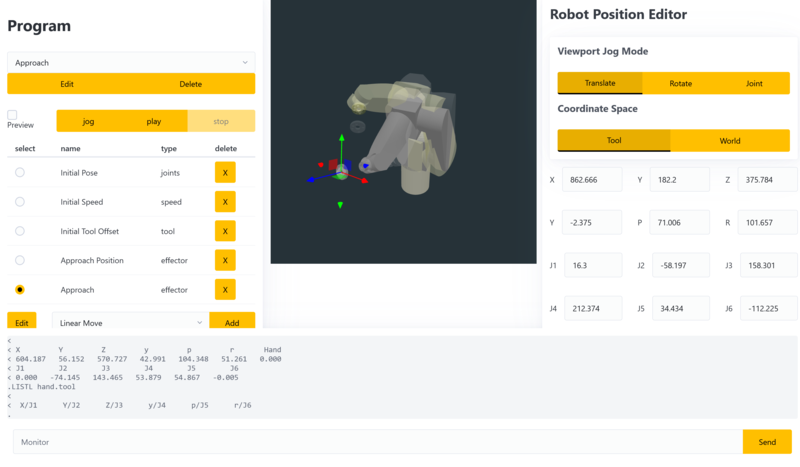

# Staubli Control

This repo includes four components:

1. Browser based control software for the Staubli TX90 6 axis serial robot
2. Python backend to translate an http api to serial terminal commands
3. NixOS operating system and ops scripts to perform development tasks
4. A writeup of the above

## Chapters

1. [Motivation](./writeup/00-context.md)
2. [Transport & Rigging](./writeup/01-commissioning.md)
3. [Fabricating Base](./writeup/02-fabricating-base.md)
4. [Boot Disk SD Emulation](./writeup/03-stabilizing.md)
5. [Prototype Software](./writeup/04-prototype-requirements.md)
6. [Software Operations](./writeup/05-operating-system.md)
7. [Dependencies](./writeup/06-framework-and-dependencies.md)
8. [Implementation](./writeup/07-implementation.md)

