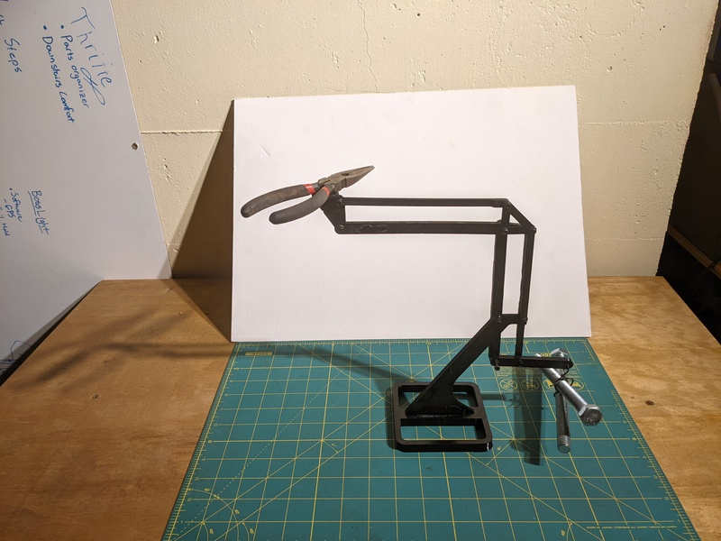
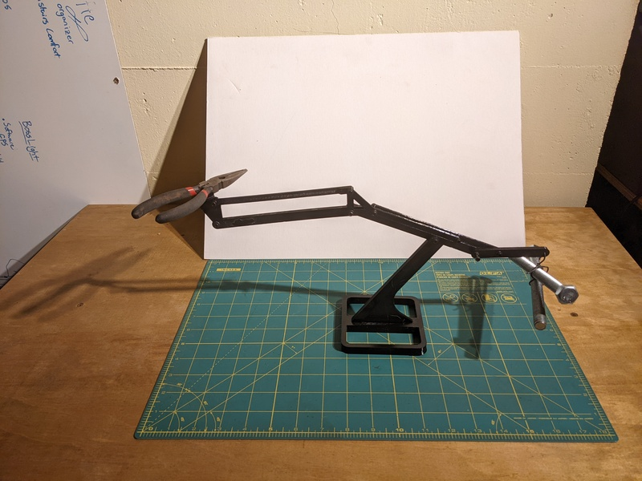

## TLDR

I bought a robot to understand the state of the art of camera motion control before designing my own
First I transported the robot to my shop and built a base
Next I stabilized the decades old hardware by emulating a SCSI drive with an SD card
Finally I implemented a modern ergonomic browser based programming system

## Inspiration

Around 3 years ago there was a spurt of youtubers creating various camera stabilization 

https://www.youtube.com/watch?v=V9e9ZWflCQU
Alexandre - Chappel Sept 2020

https://www.youtube.com/watch?v=A9Z6XS3IQbg
Mechanistic - Sept 2021

https://www.youtube.com/watch?v=t1sXvMY_vAw
Inheritance Machining - Feb 2023

This inspired me to design and print a mechanical stabilization platform

- [ ] Include photo of fusion CAD

And if I was going to make a robot arm, why not motorize it?

And if I'm going to create a robot arm... I should understand the state of the art!

Thus inspired my desire to own an industrial robot.