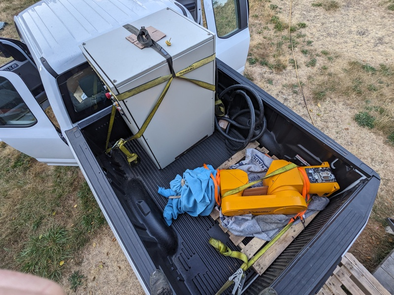
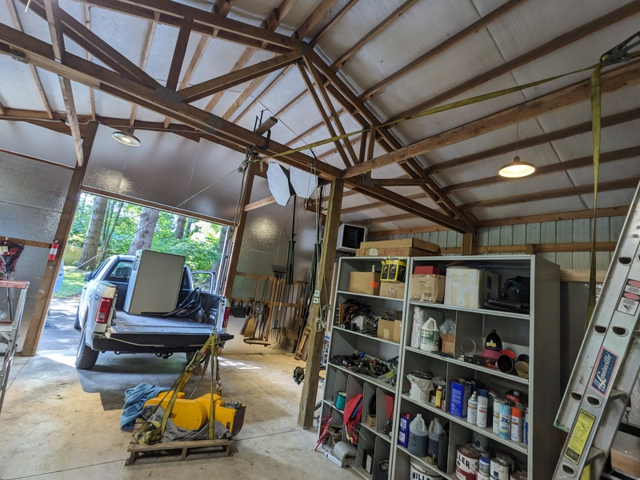
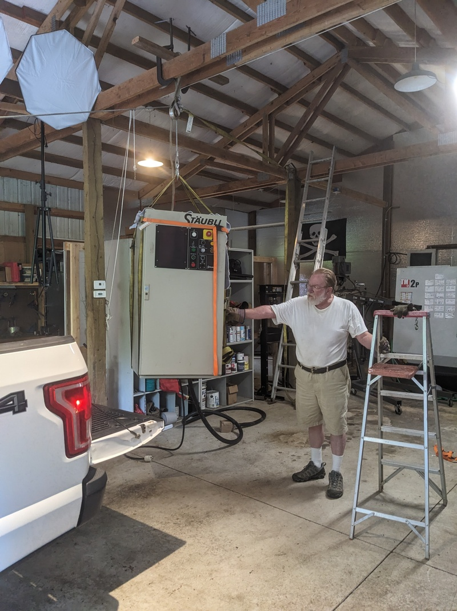

# Chapters

1. [Motivation](./00-context.md)
2. &gt; **[Transport & Rigging](./01-commissioning.md)** &lt;
3. [Fabricating Base](./02-fabricating-base.md)
4. [Boot Disk SD Emulation](./03-stabilizing.md)
5. [Prototype Software](./04-prototype-requirements.md)
6. [Software Operations](./05-operating-system.md)
7. [Dependencies](./06-framework-and-dependencies.md)
8. [Implementation](./07-implementation.md)

## Acquisition

Keeping an eye on craigslist for industrial robots I eventually found a local robot at a price point that was hard to ignore: $1,800

Loading the controller was straightforward since it started on an elevated deck, we tipped it up onto a stack of pallets and over into the bed of the truck, then uprighted it.

2024-07 - Trip to vashon

This was one of the first cases of using a second strap to locate a primary strap. Note that the black strap is keeping the yellow strap from sliding down, and that the free body diagram results in no strap sliding

## Rigging

Robot: ~80KG
Control ~250KG

Unloading was more difficult. I had recently added a winch to my overlander (1986 bronco ii), so I rigged a quick hoist. Since nothing was lift rated we moved very slowly and made sure never to stand under the load.

I was confident the rafter could support the vertical load, but the horizontal component had to be mitigated. By extending a strap opposite the direction of the winch I was able to distribute the load across the entire structure instead of a single beam

[the robot slowly moving around](01-commissioning/first-movements.mp4)

https://github.com/user-attachments/assets/e50dc4a0-271b-4eff-9987-065219d239a7

Using a leftover VFD and a quick trip to the hardware store for plugs I was able to get power to the robot and perform the first movements. Very slowly. It's just sitting balanced on the ground, spooky!

Next: [Fabricating Base](./02-fabricating-base.md)
