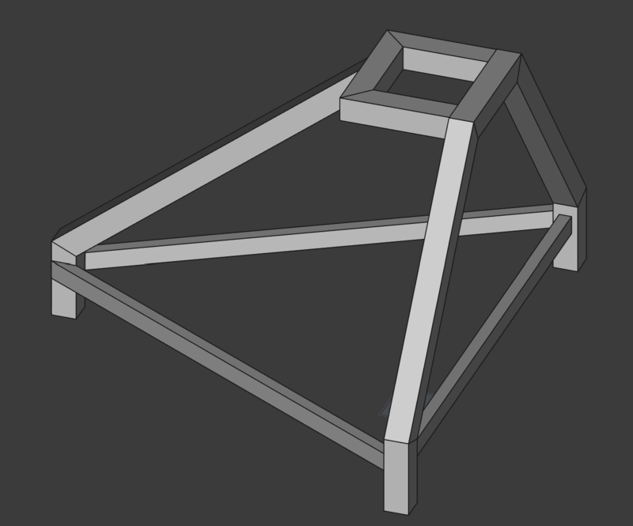
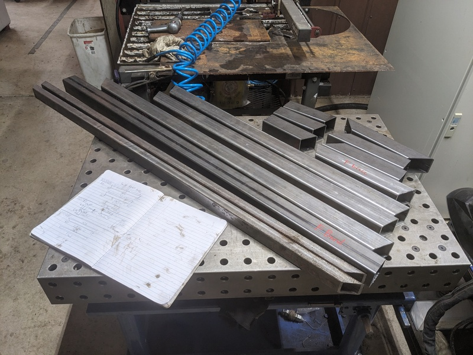
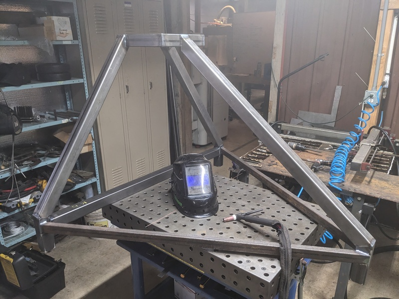
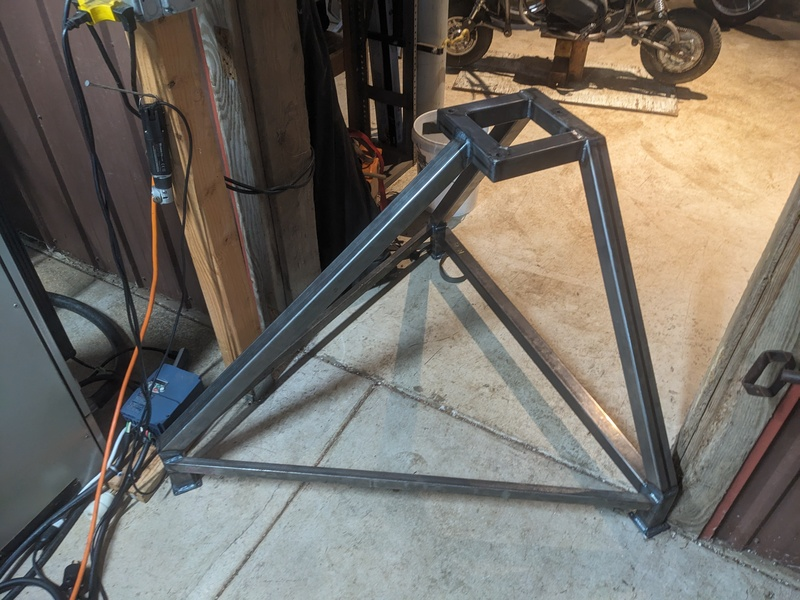
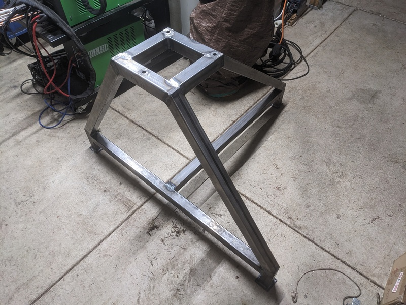
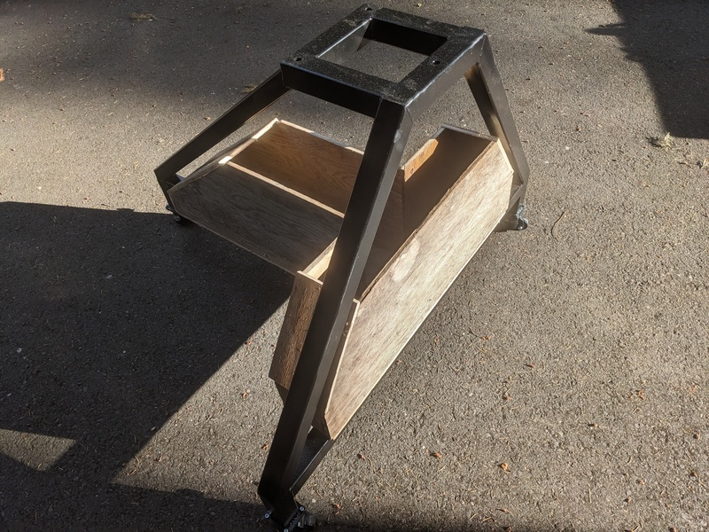
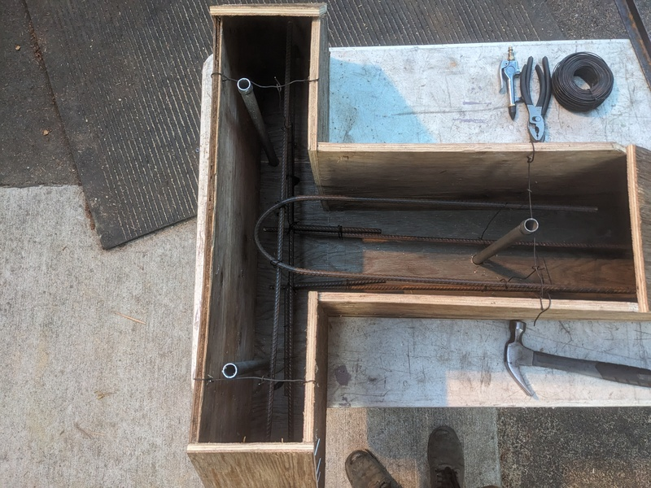
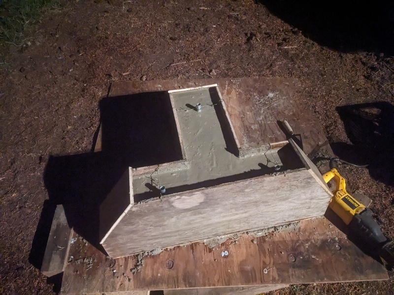
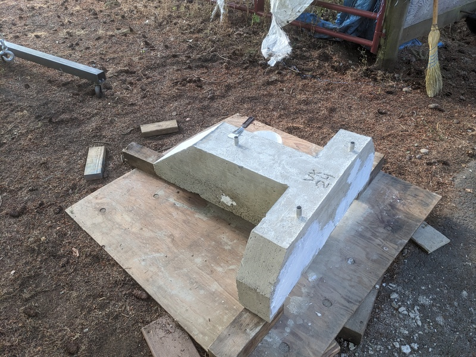
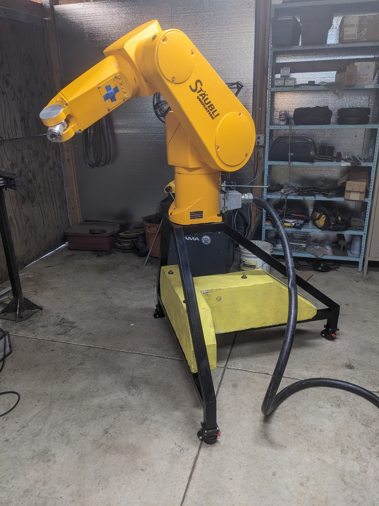

# Chapters

1. [Motivation](./00-context.md)
2. [Transport & Rigging](./01-commissioning.md)
3. &gt; **[Fabricating Base](./02-fabricating-base.md)** &lt;
4. [Boot Disk SD Emulation](./03-stabilizing.md)
5. [Prototype Software](./04-prototype-requirements.md)
6. [Software Operations](./05-operating-system.md)
7. [Dependencies](./06-framework-and-dependencies.md)
8. [Implementation](./07-implementation.md)

## Base Design

While it was exciting to move the robot while it is balanced on its base the goal is to move a camera around a workspace. Since the robot is in the fabrication room I decided the workspace is the fixture table.

Requirements:
- Hold the robot 30" off the ground
- Prevent the robot from tipping over in any orientation
- Be mobile enough to reach any place the cable can stretch to
- Fit into my fabrication competencies

Using the length and weight of the arm I determined what torque moment the base needed to withstand, and added a decent margin for error. 

On the computer I designed the base in FreeCAD using the Frame and Beams workbench

The workflow was delightful:
1. Create master sketches along the horizontal critical heights
2. Loft a solid volume between the heights
3. Construct beams on the edges of the volume
4. Use the beams planes to clip the ends

And with the 3d shapes I created 2d drawings for all of the beams, specifically including lengths and cut angles.
### Base Fabrication

All of the beams cut to length, with a paper reference

Welded together. Not included are the elaborate fixturing setups to ensure perpendicularity and correct angles. Seeing this come together was an absolute joy, it felt exactly like the CAD model led me to believe.

### DOOR STUCK

Uh oh! it doesn't fit through the doorway. This probably could have been discovered earlier.

At this point I was overwhelmed and came up with some rather overcomplicated plans to fix the issue, namely to cut a section out of 6 beams to shrink it by two inches. This seemed excessive, so I called a friend. He suggested notching one of the sides so it could spin through the doorway and inspiration struck!

This is better in every way as it dramatically reduces the floor space required, and allows the robot to slide next to and between other shop objects.
### Base Counterweight

Calculations indicated I needed about 200lbs of weight in the bottom of the frame, so I slapped together a quick model and used some quick and dirty carpentry to whip together a form

This included an absolutely delightful flow state. I was able to work as fast as I could move, and the fundamental mechanics of layout and cutting were so intuitive that I was able to think about the design while working.

Some GPT assisted research told me what rebar spacing was typical and I included affordance for through bolting to the frame

Pouring concrete was predictable. First I made a level base by shimming some plywood. Using a wheelbarrow I mixed one bag at a time and dumped it in, tucking in the edges with a poker and vibrating the bubbles out with a bladeless oscillating saw.

Removing the form inspired another moment of joy. From computer to real life with just a few hours of work. Moments like this is why I create.

And here it is painted and mounted. Not shown is the awful process of finishing the concrete with a wire wheel, or trying to spread an entire can of spraypaint as the desiccated concrete slurped down the moisture.

Next: [Boot Disk SD Emulation](./03-stabilizing.md)
