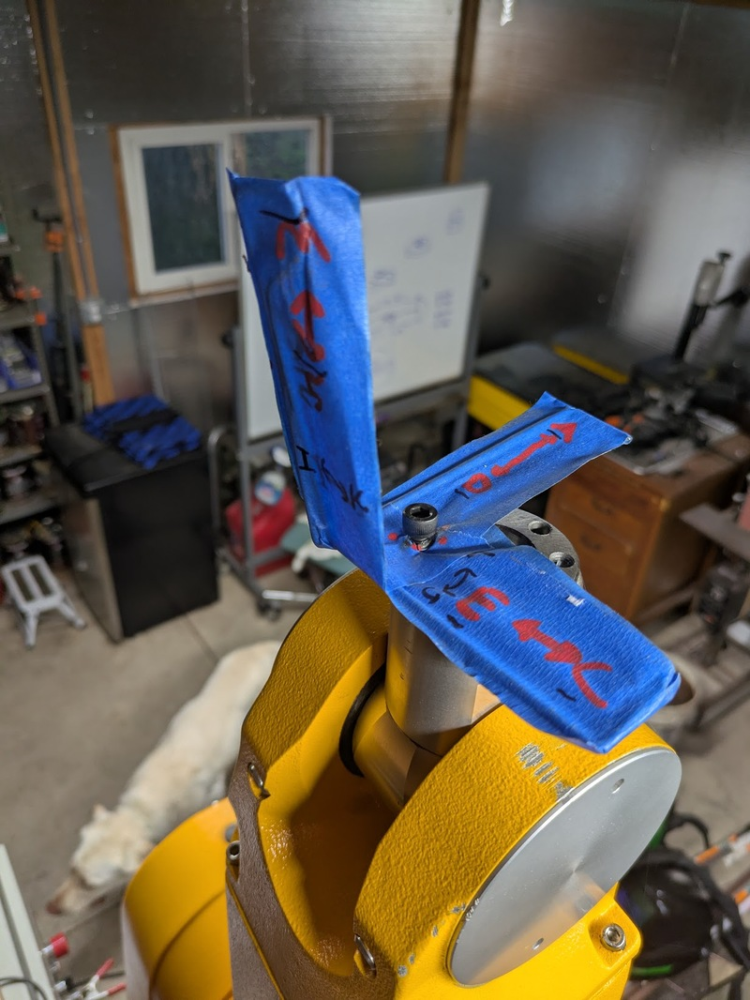

# Prototype

Building a prototype is the fastest way I know to build an intuitive understanding of the requirements of a project.
## State of the Art

The staubli robot is normally programmed from a teach pendant, but mine isn't working and I don't know why and I have been unable to find help or reasoning as to why it doesn't work.

Instead I have been programming the robot using the monitor terminal, typing directly into the controller and viewing the result on the VGA monitor. It is running an operating system and language called `V+`

There are only four commands I used on the robot

```
en po              # enable power
speed 10           # set monitor speed
do drive 1,45,10   # move drives to an offset
HERE var           # store the location
do MOVE var        # move to the location using joint interpolation
do MOVES var       # move to the location using cartesian interpolation
```

## Term based workflow

These commands are not ergonomic on their own, so my friend Benjamin and I collaborated on an initial terminal based workflow


By plugging a laptop into the serial port we can use python to connect to the controllers rs232 terminal, then we can open up a terminal emulator on the laptop and read button presses. The following commands were added over the weekend to support a basic point sequence based workflow:

```
w: move up
s: move down
a: forward
d: back
e: left
c: right

j: yaw left
l: yaw right
i: pitch down
k: pitch up
u: roll left
o: roll right

-: reduce linear step size
=: increase linear step size
_: reduce angular step size
+: increase angular step size

q: quit
r: enable power
f: clear lines and enable power

p: store a position
.: go to next position
,: go to previous position
```

Using these commands the following sequence was filmed 2025-1-11:


https://www.youtube.com/shorts/R6g0adGWjnk

## Prototype Issues

These commands are... adequate, but it can be very difficult to understand what "pitch down" means, or what "move 15mm up" actually means from a collision with the environment standpoint

In addition it was trivial to accidentally gimbal lock the robot due to a linear move causing an overspeed in a joint. Every overspeed causes the robot to halt and requires manual intervention to reset.

The last straw was trying to add tool offset: there is no way I can hold that coordinate transform in my head in any reasonable way.

## Requirements

The requirements evolved over time as I built the abstractions, as always I wish I had spent more time defining this on paper instead of in code.

> 2025-03-11
> Ok let's define "complete" so I can finish this project

1. Display current robot position in 3d
2. Store and manage a list of programs
	1. Create new
	2. Edit Program Name
	3. Load from list
	4. Delete
3. Store and manage a list of commands in a program
	1. Add command derived from current robot state
	2. Edit Command Name
	3. Joint interpolated movement command
	4. Speed command
	5. Linear interpolated movement command
	6. Tool offset command
4. Use interface to edit commands
	1. Joint setting
	2. Tool position setting
	3. Tool offset setting
	4. IK to translate tool position into joint position
5. Playback sequence
	1. Preview or playback on robot
	2. Visualize result of command
	3. Run selected command
