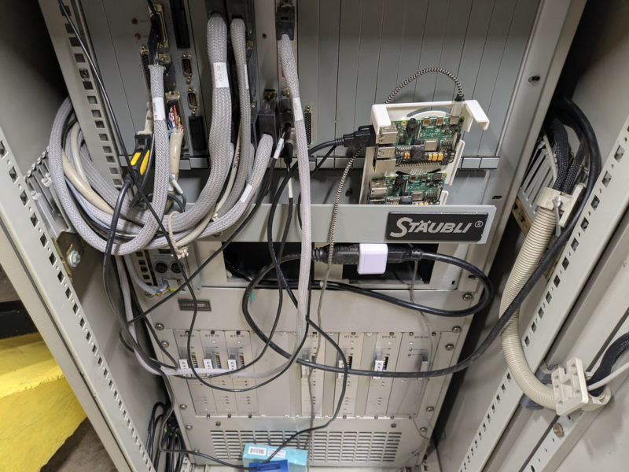

# Chapters

1. [Motivation](./00-context.md)
2. [Transport & Rigging](./01-commissioning.md)
3. [Fabricating Base](./02-fabricating-base.md)
4. [Boot Disk SD Emulation](./03-stabilizing.md)
5. [Prototype Software](./04-prototype-requirements.md)
6. **[Software Operations](./05-operating-system.md)**
7. [Dependencies](./06-framework-and-dependencies.md)
8. [Implementation](./07-implementation.md)

# Operational Requirements

Browser based software is included with the robot, intended to last as long as the hardware does.

Operational Requirements:
1. Target any "client" - phone, tablet, desktop, anything that can connect to wifi
2. Avoid dependencies on unstable software
3. Create a digital double of the robot so any inputs can be previewed
4. Make working on the software as easy as possible

I am just as concerned with the software development ergonomics as I am with the ergonomics of using the software

## Hardware Implementation

This software was originally written in windows using windows subsystem, running ubuntu. It was incredibly difficult to connect the serial port to linux due to driver issues.

2025-02-07:
1. [Use usbipd to grant WSL access to the USB device](https://askubuntu.com/questions/1461302/i-need-help-connecting-serial-ports-to-ubuntu-in-wsl)
2. [Recompile the windows subsystem kernel to have PL2303 module](https://github.com/dorssel/usbipd-win/wiki/WSL-support#building-your-own-usbip-enabled-wsl-2-kernel)

This worked for a week, and after a windows update caused the fragile workflow to break I gave up and implanted a raspi directly inside the machine



There were power issues causing the filesystem to corrupt on reboot, giving it a dedicated 5v 20w supply fixed the issue.

## Operating System Implementation

I have had excellent experiences running NixOS. Following several guides I was able to build a declarative system configuration that was able to:

1. Include the operating system
2. Include the custom software
3. Build a SD card image
4. Update a running system

all from 3 files, all able to be built locally, all able to be reproduced deterministically. This work took about two weeks.

## Networking

The raspi has a hostname which can be resolved from the local network. Each network required a substantial amount of work to figure out.

From a WSL host I have to get it to [use the local DNS server](https://superuser.com/questions/1533291/how-do-i-change-the-dns-settings-for-wsl2) for the local hostname to work:
```
vim /etc/wsl.conf

[network]
generateResolvConf = false
```

```bash
wsl --shutdown
```

```
vim /etc/resolv.conf

nameserver 192.168.1.1
nameserver 1.1.1.1
nameserver 1.0.0.1
```

```
vkhougaz@shopdog:~$ ping staubli
PING staubli (192.168.1.26) 56(84) bytes of data.
64 bytes from staubli (192.168.1.26): icmp_seq=1 ttl=63 time=104 ms
```

> Holy gosh dang it woot.
> 2025-03-03

## Packaging

Both the server side and client side code are built into the system image as a single python package. The nix `buildPythonApplication` command is used to combine the python source and the dependencies, so that the same python environment can be used on the development computer for a local copy:

```nix
# staubli.nix
{ pkgs, ... }: let
  pythonPackages = ps: with ps; [
    pyserial
    websockets
    setuptools
  ];

in rec {
  env = pkgs.python3.withPackages pythonPackages;

  package = pkgs.python3Packages.buildPythonApplication {
    pname = "staubli";
    version = "0.1";
    src = ./..;
    propagatedBuildInputs = pythonPackages pkgs.python3Packages;
    doCheck = false;
  };
}
```

The python setup file includes the HTML

```python
# setup.py
from setuptools import setup, find_packages

setup(
    name="staubli",
    version="0.1",
    packages=find_packages(),
    entry_points={
        "console_scripts": [
            "staubli-http = staubli.http.main:main",
        ],
    },
    package_data = {
        'staubli': ['html/**/*'],
    }
)
```

And the nix service includes the python package
```
# service.nix
{ pkgs, lib, ... }: let
  staubli = import ./staubli.nix { inherit pkgs; };
  serviceName = "staubli-http";
in {
  users.users.staubli = {
    isSystemUser = true;
    group = "staubli";
    extraGroups = [ "dialout" ];
  };

  users.groups.staubli = {};

  systemd.services.${serviceName} = {
    description = "Staubli HTTP Python Service";
    after = ["network.target"];
    wants = ["network.target"];
    serviceConfig = {
      ExecStart = "${staubli.package}/bin/staubli-http";
      WorkingDirectory = "${staubli.package}";
      Restart = "always";
      User = "staubli";
      Group = "staubli";

      # allow binding port 80
      SecureBits = "keep-caps";
      AmbientCapabilities = "CAP_NET_BIND_SERVICE CAP_NET_ADMIN";
      CapabilityBoundingSet = "CAP_NET_BIND_SERVICE CAP_NET_ADMIN";
    };
    wantedBy = ["multi-user.target"];
  };
}
```

## Serial Simulation

The interface the web server sees to the robot is rather straightforward, and the cost of traveling to the robot, starting the controller, and connecting to the serial port is high. It proved IMMEDIATELY worthwhile to create a simulated terminal for the robot. If the web server fails to connect to the robots serial port then it creates a mock serial interface which maintains a limited set of robot state. New simulator functionality can be initially created based on the robots manual, and it can be proven against the actual robot at a future date.
## Final Workflow

1. Develop locally using a simulated serial port
```
python -m staubli.http.main
```
2. Create an SD card image
```
nix build .#pi-image --builders "ssh://serverbox.zone aarch64-linux"
```
3. Burn that image to an SD card using [unetbootin](https://unetbootin.github.io/)
4. Boot the SD card
5. Run "dev" to stop the service and push a development copy to mutable storage
```
rsync --archive --verbose --human-readable \
    --exclude='*.pyc' --delete-excluded \
    ./staubli/ $UPLOAD_USER@$HOST:/home/$UPLOAD_USER/staubli \
    --delete

ssh -t $UPLOAD_USER@$HOST "\
    echo 'Configuring .env' && \
    echo '# dev-staubli.sh' > .env && \
    echo 'SERIAL_DEVICE=/dev/ttyUSB0' >> .env && \
    echo 'HTTP_PORT=8000' >> .env && \
    echo 'Starting dev service' && \
    python -m 'staubli.http.main'\
"
```
6. Run "update" to send new system images over SSH
```
SYSTEM=$(nix build \
    .#nixosConfigurations.staubli.config.system.build.toplevel \
    --builders "ssh://serverbox.zone aarch64-linux" \
    --no-link --print-out-paths)

nix copy --no-check-sigs --to ssh-ng://root@$HOST $SYSTEM

# lol this is a trip
ssh root@$HOST " \
    nix-env -p /nix/var/nix/profiles/system --set ${SYSTEM} \
    && ${SYSTEM}/bin/switch-to-configuration switch \
    && nix-collect-garbage \
    && systemctl restart staubli-http"
```

Next: [Dependencies](./06-framework-and-dependencies.md)
