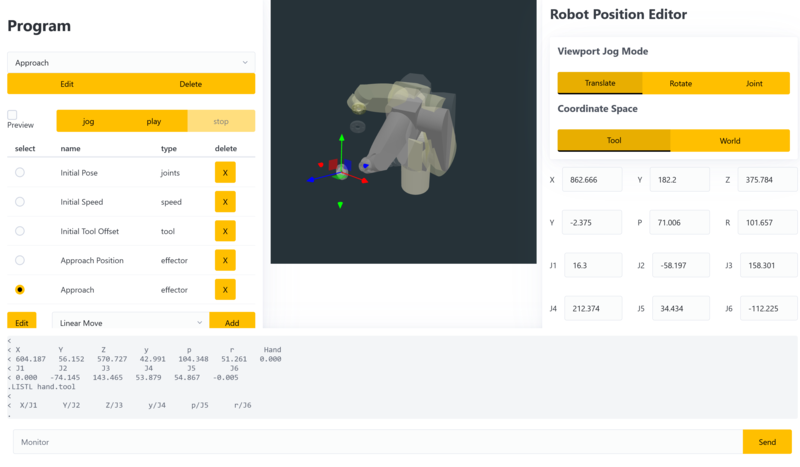
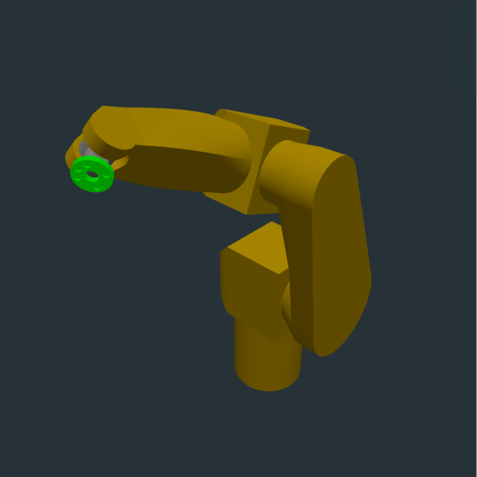
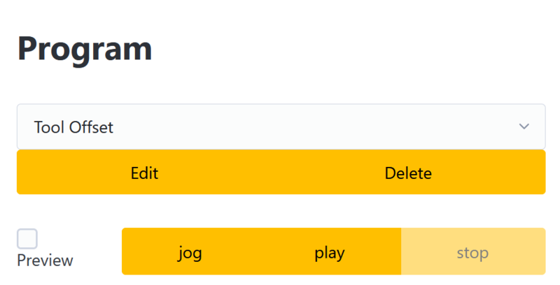
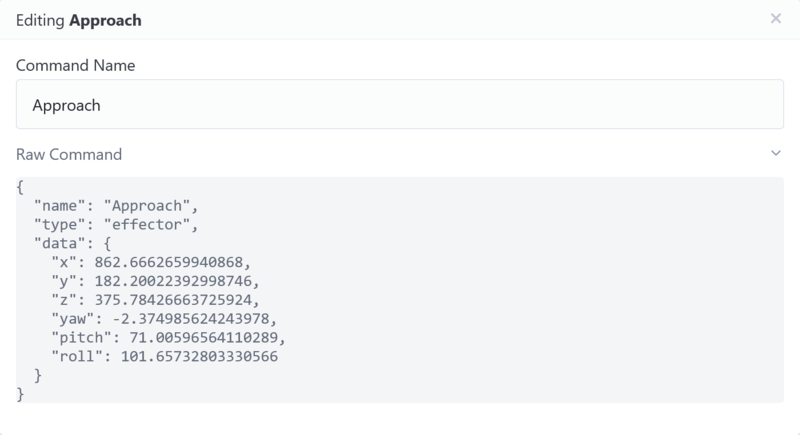
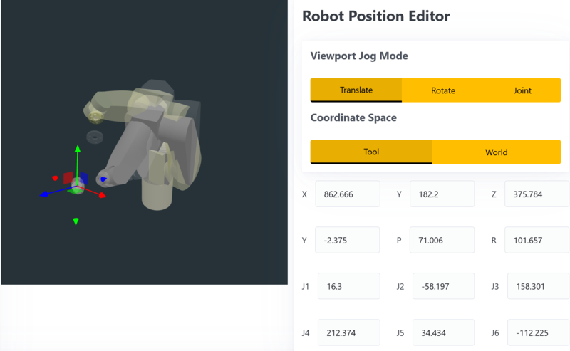

# Chapters

1. [Motivation](./00-context.md)
2. [Transport & Rigging](./01-commissioning.md)
3. [Fabricating Base](./02-fabricating-base.md)
4. [Boot Disk SD Emulation](./03-stabilizing.md)
5. [Prototype Software](./04-prototype-requirements.md)
6. [Software Operations](./05-operating-system.md)
7. [Dependencies](./06-framework-and-dependencies.md)
8. &gt; **[Implementation](./07-implementation.md)** &lt;

The premise of the new control system is to present a visual example of the robots movement before triggering it, and to use familiar and resilient strategies to build it.

There are 5 major features
1. Display current robot state
2. Store and manage a list of programs
3. Store and manage a list of commands in a program
4. Use interface to edit commands
5. Playback sequence



## Displaying the robot state

When a user visits the robot web interface the browser requests the current state. This is translated into serial commands, which are executed and the results parsed by the web server. The results are combined into a single robot state object, which is "pushed" onto a Robot instance



```
.where
< 
< X         Y         Z         y         p         r       Hand
< 604.187   56.152   570.727   42.991   104.348   51.261   0.000
< J1        J2        J3        J4        J5        J6
< 0.000   -74.145   143.465   53.879   54.867   -0.005
.LISTL hand.tool
< 
<  X/J1      Y/J2      Z/J3      y/J4      p/J5      r/J6
.
```

The angle took a long time to figure out, it is ZYZ intrinsic euler rotation. This does not match the conventions of any of the libraries and had to be converted back and forth.
## Store and manage programs



The state system described earlier was straightforward to wrap in browser localstorage which allowed me to create and list programs.

## Store and manage commands

There are currently 4 commands:
- Joint position - linearly interpret joint values to go to a new position
- Effector position - linearly interpret cartesian effector location to go to a new position in a line
- Speed - set the robot speed
- Tool Offset - set the tool offset

Each command maps to a single call to the web server, which waits until the command is complete and returns the updated robot state.

Commands can have a name which is editable in a modal. The modal also displays the "raw" representation of the command


## Edit Commands

Commands that update the robots position are all displayed simultaneously in the viewport, and have a similar interface



The robot position can be updated either using the viewport or the text fields, and updates to the effector position are propagated to the joints using inverse kinematics, and joint positions are updated to the effector position using forward kinematics.

In "Joint" jog mode the robots model can be clicked and dragged to move the joint, and in "Translate" and "Rotate" modes a widget is displayed in the viewport. The widget can be in the global coordinate frame, for example to move up or down. It can also be in the tool frame, for example to approach at an angle.

Using tool offset the tool frame can be updated, this allows operations such as an orbit to be achieved:
1. Set the tool offset away from the robot arm
2. Rotate the tool offset and hold it in place

This causes the robot to move in a circular path in a single command, interpreted in the control.

All command updates are immediately saved

## Playback

There are two ways to play back commands, either live or in a preview.
### Live Playback

Live playback is straightforward:
1. For each command
2. Send the command to the robot
3. Wait for the command to finish
4. Update the displayed robot state

## Preview playback

Preview is more difficult. The motion control of the robot is implemented inside the controller, in order to visualize it an approximation was implemented in javascript.

The motion control is built on a trapezoidal velocity profile:
1. Accelerate at a rate until maximum velocity is reached
2. Continue at that velocity until deceleration is required
3. Decelerate at a rate until stopped at the desired location

When a motion command is requested the motion planner follows this process:
1. Calculate a velocity profile for each axis
2. Determine the slowest axis
3. Rescale other axes to accelerate at a slower rate to keep in time with the slowest axis

Joint interpolation uses 6 axes based on the joint angle. Linear interpolation uses XYZ and Pitch Yaw Roll. Due to the ZYZ convention linearly interpolating these values produces a useful result.


https://github.com/user-attachments/assets/b8d4f3e3-3c05-4f84-905b-40f87e6f1066


If you observe the wrist joint during the first move you can see a rapid twist due to gimbal lock. This will likely overspeed the robot joint causing it to halt. Adding intermediate points can prevent this.

The preview robot is implemented using the same interface as the actual robot, so the "playback" code doesn't care or even know what type of robot it is playing back into

### Jogging

"Jogging" the robot simply means executing a single command. An alternative way to use the robot is to consider the command list a "palette" and to manually invoke the commands one at a time. This was an unexpected discovery and bears further UX consideration

## Implementation Difficulty

Some parts of this implementation were surprisingly straightforward:
1. State management - this worked exactly as expected and didn't fight back
2. Components - this worked well enough and was predictable and easy to debug
3. Serial commands - very straightforward, very predictable

And some parts fought back much more than expected:
1. Coordinate frames - mapping between threejs local and global, and the robots coordinate system was very difficult, especially the ZYZ angles.
2. Functional Reactive 3d - reusing the three scene objects caused problems
3. Kinematic and visualization conflation

The last point deserves a bit more architectural musing. One key principle for an understandable architecture is to have a unidirectional flow of information. A user event triggers a state update, which propagates down the tree until it results in a render.

With the libraries I am using the visualization is tied to the kinematic model. The only way to know what joint values correlate to an effector position is to display them and query the result. When I am trying to pre-calculate the joint values during a state update I have to display it, which requires a state update, which then causes a state update and it gets nasty.

This should probably be addressed with an invisible off screen robot used purely for calculations

## Demo

Here is a shot using this software to control the robot


https://github.com/user-attachments/assets/7325dca0-d2af-4d30-a481-9bf5befac03a


## Status and Next Steps

This program is enough to serve my needs of basic video capture motion control. Some future effort would help out quite a bit:

 - Programs
	 - Storing on the web server for reuse
	 - Composing sub-programs
 - Commands
	 - Reordering
	 - Copy paste
	 - Sharing between programs
 - Playback
	 - Reduction of visual clutter
	 - Automatic identification of gimbal lock
	 - Timeline with keypoints similar to 3d animation software
 - Video Capture
	 - Allowing frame-by-frame capture for precise motion control
	 - Preview of camera in viewport
 - Scenes
	 - Adding props to the scene for motion planning
	 - Collision checking
